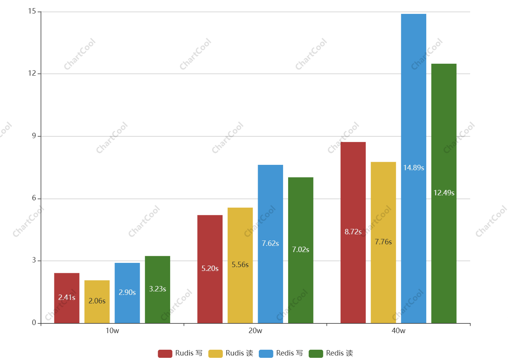

## 项目介绍


<br />

[Github](https://github.com/sleeprite/rudis) | [Gitee](https://gitee.com/Jmysy/rudis) | [Discord](https://discord.gg/38tMsRc3) | [Linux](./release/linux) | [Windows](./release/windows)

<a href="https://github.com/sleeprite/rudis"></a>
<a href="https://gitee.com/Jmysy/rudis"></a>

Rudis 是一个高性能内存数据库。

Rudis 是采用 Rust 语言开发的项目，旨在利用 Rust 语言的优势来重新实现 Redis 的核心功能，以满足用户对高性能、可靠性和安全性的需求，同时保持与 Redis API 的兼容。

### 特性

- 跨平台，兼容 windows、linux 系统架构。
- 兼容 字符串、集合、哈希、列表、有序集合数据结构。
- 提供 rdb 与 aof 机制以支持数据备份和恢复。
- 兼容 Redis 的命令和协议规范。

## 快速入门

- 启动画面

```
     /\_____/\
    /  o   o  \          Rudis 0.0.1
   ( ==  ^  == )
    )         (          Bind: 127.0.0.1:6379
   (           )
  ( (  )   (  ) )        
 (__(__)___(__)__)
    
[2024-04-30T02:00:55Z INFO  rudis_server] Start loading appendfile
[=======================================] percent: 100% lines: 6/6 
[2024-04-30T02:00:55Z INFO  rudis_server] Server initialized
[2024-04-30T02:00:55Z INFO  rudis_server] Ready to accept connections
```

- 本地调试

```
// 普通启动
cargo run

// 带参启动
cargo run -- --port 8848

// 指定配置
cargo run -- rudis.properties

// 构建程序
cargo build

cargo build --release 

cargo build --release --target=x86_64-unknown-linux-musl
```

## 启动参数

- port 端口, 默认: 6379
- save RDB 保存策略, 默认：None
- password 密码, 默认：None
- databases 数据库数量, 默认：16
- appendfilename 持久化日志路径，默认：None
- appendonly 开启持久化，默认：false
- dbfilename 数据文件名，默认：dump.rdb
- maxclients 会话上限，默认 1000
- hz 定时任务的频率，默认 10（次/秒）
- dir 数据持久化目录，默认 "./"
- bind 绑定的主机地址

## 项目结构

### aof

aof 包实现了 appendonlyfile 的核心逻辑，该包负责将操作写入和追加到 AOF 文件中，确保 Redis 数据库的数据持久性和一致性。

### command

command 包是一个用 Rust 编写的模拟Redis服务器的组件，主要负责实现Redis协议的解析、数据库操作的执行以及相关结果的响应。该包内部包含了针对不同Redis命令的实现，如SELECT、GET、SET等。其核心功能是根据Redis协议规范，解析来自客户端的命令请求，并在模拟的Redis数据库上执行相应的操作，再将结果返回给客户端。通过实现各个Redis命令处理器，实现了对Redis协议的完整支持，并提供了一个简单而有效的策略来处理不同类型的命令。

### db

db 包是一个基于内存的数据库管理系统。该模块提供了基础的数据结构约定，以及数据库操作功能，包括对数据的增、删、改、查等操作。

### session

session 模块的设计目的是提供一个简单的会话管理功能，用于跟踪用户的操作状态，例如用户所选的数据库索引以及用户是否已认证等信息。这对于需要进行用户认证或者跟踪用户操作状态的系统是非常有用的。

### tools

tools 包是一个工具包，其中包含了一些通用的工具函数或工具类，用于辅助实现系统功能或处理特定任务。这些工具可以被其他模块或组件调用，以提高代码复用性和降低重复编写相似功能的工作量。

## 操作命令

echo 命令
```
127.0.0.1:6379> echo helloword
helloword
```

ping 命令
```
127.0.0.1:6379> ping
PONG
```

set 命令
```
127.0.0.1:6379> set user bailiang
OK
```

set 命令 [过期]
```
127.0.0.1:6379> set user bailiang px 10000
OK
127.0.0.1:6379> set user bailiang ex 10
OK
```

get 命令
```
127.0.0.1:6379> get user
bailiang
```

del 命令
```
127.0.0.1:6379> del username
(integer) 1
127.0.0.1:6379> del username password
(integer) 2
```

exists 命令
```
127.0.0.1:6379> exists user
(integer) 0
```

keys 命令
```
127.0.0.1:6379> keys *
(empty list or set)
```

auth 命令
```
127.0.0.1:6379> auth 123456
OK
```

expire 命令
```
127.0.0.1:6379> expire user 10000
(integer) 0
```

select 命令
```
127.0.0.1:6379> select 1
OK
```

dbsize 命令
```
127.0.0.1:6379> dbsize
(integer) 2
```

flushdb 命令
```
127.0.0.1:6379> flushdb
OK
```

flushall 命令
```
127.0.0.1:6379> flushall
OK
```

append 命令
```
127.0.0.1:6379> append user bailiang
(integer) 10
```

move 命令
```
127.0.0.1:6379> move user 0
OK
```

rename 命令
```
127.0.0.1:6379> rename username new_username
OK
```

rpush 命令
```
127.0.0.1:6379> rpush key value1 value2
OK
```

lpush 命令
```
127.0.0.1:6379> lpush key value3 value4
OK
```

llen 命令
```
127.0.0.1:6379> llen key
(integer) 4
```

## 更新计划

- [x] 持久存储，存储每条修改命令到本地文件，启动时重新加载实现持久化存储；
- [x] 日志体系，完善系统中日志打印，制订规范，帮助使用者更快速的追溯问题；
- [x] 测试用例，针对项目中的每个命令，编写对应的单元测试，提高项目稳定性；
- [ ] 性能优化，使用 Tokio 代替原生的 Thread 通讯方案，以获得更高的性能；
- [ ] 主从同步，增加主从同步配置，实现多实例运行，以保证服务的容错与稳定；
- [ ] 测试用例，根据 commands 清单，编写软件的单元测试用例，保证稳健发布；

## 数据结构

- [x] List
- [x] Hash
- [x] Zset
- [x] String
- [x] Set

## 命令列表

| Command | Supprt | Appendfile | Test case | Document | 
| ------- | ------ | ---------- | --------- |--------- |
| set     | ✅    | ✅         | ✅       | ✅       |
| get     | ✅    | ⚪         | ✅       | ✅       |
| del     | ✅    | ✅         | ✅       | ✅       |
| echo    | ✅    | ⚪         | ⚪       | ⛔       |
| flushdb | ✅    | ✅         | ⛔       | ⛔       |
| flushall| ✅    | ✅         | ⛔       | ⛔       |
| dbsize  | ✅    | ⚪         | ⛔       | ⛔       |
| auth    | ✅    | ⚪         | ⛔       | ⛔       |
| select  | ✅    | ✅         | ⛔       | ⛔       |
| llen    | ✅    | ⚪         | ✅       | ⛔       |
| exists  | ✅    | ⚪         | ✅       | ⛔       |
| expire  | ✅    | ✅         | ✅       | ⛔       |
| rename  | ✅    | ✅         | ✅       | ⛔       |
| move    | ✅    | ✅         | ⛔       | ⛔       |
| lpush   | ✅    | ✅         | ✅       | ⛔       |
| rpush   | ✅    | ✅         | ✅       | ⛔       |
| append  | ✅    | ✅         | ✅       | ⛔       |
| incr    | ✅    | ✅         | ⛔       | ⛔       |
| decr    | ✅    | ✅         | ⛔       | ⛔       |
| lindex  | ✅    | ⚪         | ✅       | ⛔       |
| lpop    | ✅    | ✅         | ⛔       | ⛔       |
| rpop    | ✅    | ✅         | ⛔       | ⛔       |
| lrange  | ✅    | ⚪         | ⛔       | ⛔       |
| ttl     | ✅    | ⚪         | ⛔       | ⛔       |
| pttl    | ✅    | ⚪         | ⛔       | ⛔       |
| type    | ✅    | ⚪         | ⛔       | ⛔       |
| sadd    | ✅    | ✅         | ✅       | ⛔       |
| smembers| ✅    | ⚪         | ✅       | ⛔       |
| scard   | ✅    | ⚪         | ✅       | ⛔       |
| hmset   | ✅    | ✅         | ✅       | ⛔       |
| hget    | ✅    | ⚪         | ✅       | ⛔       |
| hdel    | ✅    | ✅         | ✅       | ⛔       |
| hexists | ✅    | ⚪         | ✅       | ⛔       |
| hset    | ✅    | ✅         | ✅       | ⛔       |
| keys    | ✅    | ⚪         | ✅       | ⛔       |
| zadd    | ✅    | ✅         | ⛔       | ⛔       |
| zscore  | ✅    | ⚪         | ⛔       | ⛔       |
| zcard   | ✅    | ⚪         | ⛔       | ⛔       |
| zcount  | ✅    | ⚪         | ⛔       | ⛔       |
| pexpire | ✅    | ⚪         | ⛔       | ⛔       |
| mset    | ✅    | ✅         | ⛔       | ⛔       |

## 性能测试



 - percent: 100% lines: 100000/100000 time: 00:00:04

 - percent: 100% lines: 200000/200000 time: 00:00:09

 - percent: 100% lines: 400000/400000 time: 00:00:19

## 周边工具

Rudis visualizer [下载](./examples/rudis_visualizer.py)


## 开源共建

Rudis 项目遵循 [GNU GENERAL PUBLIC LICENSE](https://github.com/sleeprite/rudis/blob/master/LICENSE) 开源协议，感谢这些优秀的 [Contributors](https://github.com/sleeprite/rudis/graphs/contributors)。

<a href="https://github.com/sleeprite/rudis/graphs/contributors">
  
</a>