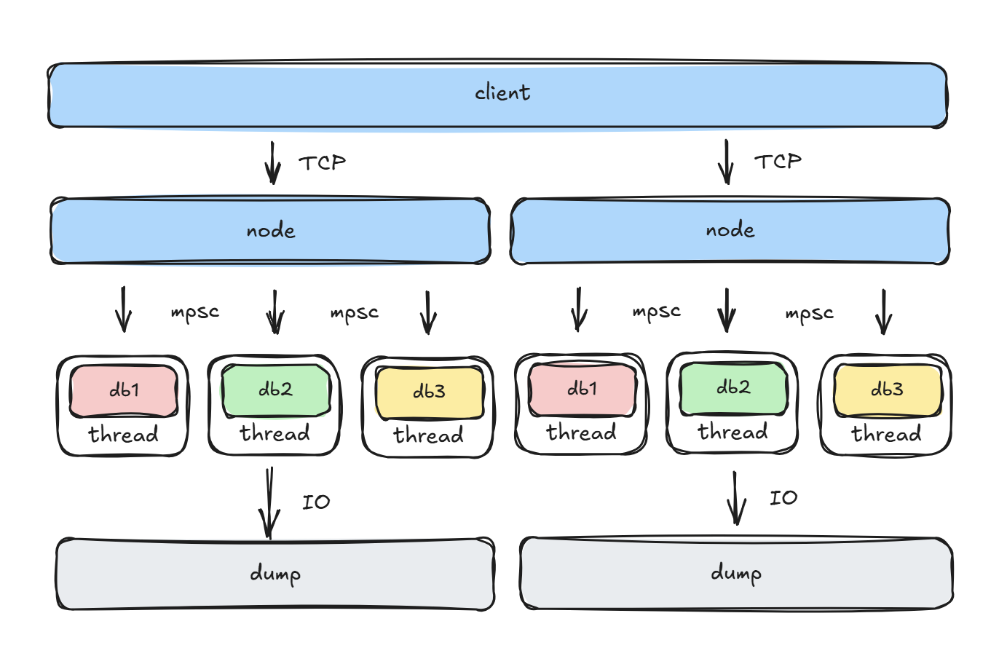

<div align="center">

<br />


<br />

[ROADMAP 2026](./ROADMAP-2026.md)

[Github](https://github.com/lunar-landing/rudis) | [Gitee](https://gitee.com/lunarlanding/rudis) | [Packages](./release) | [Docker](https://github.com/lunar-landing/rudis/blob/master/docker/README.md) 

<a href='https://gitee.com/lunarlanding/rudis/stargazers'></a>
<a href="https://gitcode.com/rudis/rudis/stargazers"></a>
<a href="https://github.com/lunar-landing/rudis"></a>
<a href="https://github.com/lunar-landing/rudis/blob/master/LICENSE"></a>

<h4>高 性 能 内 存 数 据 库 </h4>

**[🔶 Explore the docs »](https://sleeprite.github.io/rudis)**

</div>

## 项目介绍

Rudis 是一个采用 Rust 语言编写得高性能键值存储系统，旨在利用 Rust 语言的优势来重新复现 Redis 的核心功能，以满足用户对高性能、可靠性和安全性的需求，同时保证与 Redis API 的兼容。

### 🌟 特性

- 跨平台，兼容 windows、linux、macos 系统。
- 兼容 字符串、集合、哈希、列表、有序集合、HyperLogLog、JSON数据结构。
- 提供 rdb 与 aof 机制以支持数据备份和恢复。
- 拥有卓越的处理速度和即时响应能力。
- 多个线程中并发创建和删除键值。
- 提供 Docker 部署方式。
- 兼容 RESP 协议规范。

## 快速入门


```

         /\_____/\
        /  o   o  \          Rudis 0.4.0
       ( ==  ^  == )
        )         (          Bind: 6379 PID: 40252
       (           )
      ( (  )   (  ) )        Role: master
     (__(__)___(__)__)

    Rudis is a high-performance in memory database.
    
⣷ [████████████████████████████████████████] 200000/200000 (100%) Status: Completed

[2025-12-03T03:49:43Z INFO  rudis_server::server] Server initialized
[2025-12-03T03:49:43Z INFO  rudis_server::server] Ready to accept connections
```

### 普通安装

根据系统环境要求，[下载](./release) 匹配的 Rudis 版本

通过系统常规命令启动 Rudis 服务

```sh 
// windows 常规启动
start rudis-server.exe

// windows 配置文件启动
start rudis-server.exe --config ./config/rudis.conf

// windows 指定参数启动
start rudis-server.exe --port 6379
```

### 容器安装

通过 docker 容器启动 Rudis 服务

如需更多安装命令，请前往 [docker/README.md](./docker/README.md) 查看

```sh 
// docker 常规启动
docker run --rm -p 6379:6379 -p 7379:7379 ghcr.io/lunar-landing/rudis:latest

// docker 指定参数启动
docker run --rm -p 6379:8848 ghcr.io/lunar-landing/rudis:latest --port 8848
```

## 配置说明

- 配置文件 (config): 指定Rudis配置文件路径。
- 绑定的主机地址 (bind): 指定Rudis服务器绑定地址。
- 端口 (port): Rudis服务器监听端口，默认6379。
- 密码 (password): 设置Rudis访问密码。
- 数据库数量 (databases): Rudis数据库数量，默认16。
- 数据持久化目录 (dir): RDB和AOF文件存储目录，默认"./"。
- 持久化日志路径 (appendfilename): AOF日志文件存储路径。
- 开启持久化 (appendonly): 是否开启AOF持久化。
- 数据文件名 (dbfilename): RDB持久化文件名，默认"dump.rdb"。
- 会话上限 (maxclients): 最大客户端连接数，默认1000。
- 定时任务频率 (hz): 定时任务执行频率，默认10次/秒。
- RDB保存策略 (save): 设置RDB自动保存条件。

## 网络架构



## 项目结构

### cmds

Cmds 包是一个用 Rust 编写的模拟Rudis服务器的组件，主要负责实现Rudis协议的解析、数据库操作的执行以及相关结果的响应。该包内部包含了针对不同Rudis命令的实现，如SELECT、GET、SET等。其核心功能是根据Rudis协议规范，解析来自客户端的命令请求，并在模拟的Rudis数据库上执行相应的操作，再将结果返回给客户端。通过实现各个Rudis命令处理器，实现了对Rudis协议的完整支持，并提供了一个简单而有效的策略来处理不同类型的命令。

### network

Network 模块是 Rudis 的网络通信核心组件，负责处理客户端连接、会话管理和网络数据传输。该模块基于 Tokio 异步运行时构建，提供了高性能的 TCP 连接处理能力和并发连接支持。通过 Connection 封装了底层 TCP 流的读写操作，Session 管理客户端会话状态，SessionManager 提供线程安全的会话存储和检索，SessionRole 定义不同类型的客户端角色。整个模块采用了异步非阻塞的设计理念，能够有效处理大量并发连接，确保服务器在网络层面的高性能和稳定性。

### persistence

Persistence 模块提供了 AOF（Append-Only File）和 RDB（Rudis Database） 两种持久化机制，它们共同确保了 Rudis 数据库的数据持久性和一致性。AOF 机制通过记录每个写操作并将它们追加到 AOF 文件中，实现了数据的持续更新和完整性。这种机制对于数据的准确性和可靠性至关重要，尤其是在系统故障或重启后能够确保数据的恢复。

### store

Store 模块是 Rudis 的核心内存数据库引擎，提供了高性能的键值存储功能。该模块实现了多种数据结构，包括字符串、哈希表、列表、集合和有序集合，支持丰富的数据操作命令。通过线程安全的设计和高效的内存管理机制，Store 模块能够在高并发环境下提供稳定的读写性能。同时，该模块还内置了键的过期时间管理、惰性删除等高级特性，确保数据的一致性和系统的稳定性。

### args

Args 模块是 Rudis 的命令行参数和配置文件解析器，负责处理服务器启动时的各种配置选项。该模块基于 clap 库实现，支持丰富的命令行参数和配置文件加载功能，能够灵活地配置服务器的各项参数，包括网络绑定、端口设置、认证密码、持久化选项、数据库数量等。通过智能的配置合并机制，命令行参数优先于配置文件，确保了配置的灵活性和可覆盖性。

### command

Command 模块是 Rudis 的命令解析和分发中心，负责将客户端发送的命令请求解析为具体的命令对象并分发给相应的处理器执行。该模块实现了完整的 Redis 命令体系，支持字符串、哈希、列表、集合、有序集合等数据结构的操作命令，以及服务器管理、事务处理、主从复制等高级功能命令。通过统一的命令解析接口，能够将 RESP 协议格式的命令帧转换为内部命令对象，并根据命令类型决定是否需要持久化到 AOF 文件或传播到从节点。

### frame

Frame 模块是 Rudis 中负责处理 RESP (Redis Serialization Protocol) 协议的核心组件，定义了命令帧的数据结构并提供完整的序列化和反序列化功能。该模块支持 Simple String、Bulk String、Integer、Array、Error、Null 等多种 RESP 数据类型，能够准确解析来自客户端的命令请求并将其转换为内部可处理的数据结构。Frame 模块还特别实现了粘连命令处理机制，能够有效处理网络传输中可能出现的多个粘连命令帧，确保命令的正确解析和执行。通过高效的编码和解码实现，该模块保障了 Redis 客户端与服务器之间的高效稳定通信。

### replication

Replication 模块实现了 Rudis 的主从复制功能，允许一个或多个从节点连接到主节点以实现数据同步和高可用性。该模块支持完整的主从复制流程，包括连接建立、握手、全量同步和增量同步。通过 PSYNC 命令实现主从节点的连接和数据同步，支持断线重连和增量数据传输，有效减少了网络带宽消耗和同步时间。在全量同步过程中，主节点生成 RDB 快照文件并传输给从节点，而在增量同步阶段则实时传播写命令。该模块还维护了复制连接的状态管理，确保主从关系的稳定性和数据一致性，为构建高可用的 Rudis 集群提供了坚实的基础。

### server

Server 模块是 Rudis 的核心入口点，负责整个服务器的启动、配置解析和客户端请求处理。它整合了网络通信、数据库管理、持久化和复制等功能模块，构成了完整的 Rudis 服务器实现。

## 常用命令

echo 命令
```
127.0.0.1:6379> echo helloword
helloword
```

ping 命令
```
127.0.0.1:6379> ping
PONG
```

set 命令
```
127.0.0.1:6379> set user bailiang
OK
```

get 命令
```
127.0.0.1:6379> get user
bailiang
```

del 命令
```
127.0.0.1:6379> del username
(integer) 1
127.0.0.1:6379> del username password
(integer) 2
```

exists 命令
```
127.0.0.1:6379> exists user
(integer) 0
```

keys 命令
```
127.0.0.1:6379> keys *
(empty list or set)
```

auth 命令
```
127.0.0.1:6379> auth 123456
OK
```

expire 命令
```
127.0.0.1:6379> expire user 10000
(integer) 0
```

select 命令
```
127.0.0.1:6379> select 1
OK
```

dbsize 命令
```
127.0.0.1:6379> dbsize
(integer) 2
```

append 命令
```
127.0.0.1:6379> append user bailiang
(integer) 10
```

move 命令
```
127.0.0.1:6379> move user 0
OK
```

> 有关事务功能的详细信息，请参阅 [事务功能说明](README-TRANSACTIONS.md)

## 构建源码

如果你希望通过构建源码的方式，得到发行包。

请使用 cargo 常用命令。

```
// 普通启动
cargo run

// 带参启动
cargo run -- --port 8848
cargo run -- --save 20/1 60/2

// 指定配置
cargo run -- --config rudis.conf

// 构建程序
cargo build

cargo build --release --target=x86_64-unknown-linux-musl

cargo build --release

// 代码检测
cargo clippy
```

## Star History

[](https://www.star-history.com/#sleeprite/rudis&Date)

## 开源共建

Rudis 项目遵循 [GNU GENERAL PUBLIC LICENSE](https://github.com/lunar-landing/rudis/blob/master/LICENSE) 开源协议,感谢这些优秀的 [Contributors](https://github.com/lunar-landing/rudis/graphs/contributors)。

<a href="https://github.com/lunar-landing/rudis/graphs/contributors">
  
</a>
